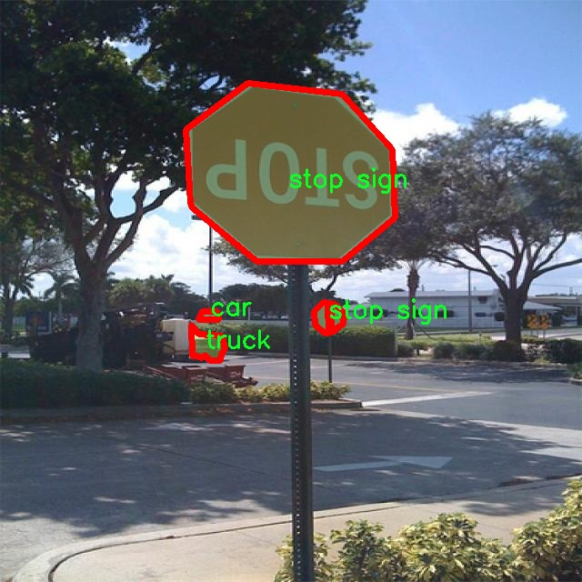

# 交通工具图像分割系统： yolov8-seg-C2f-RFCAConv

### 1.研究背景与意义

[参考博客](https://gitee.com/YOLOv8_YOLOv11_Segmentation_Studio/projects)

[博客来源](https://kdocs.cn/l/cszuIiCKVNis)

研究背景与意义

随着城市化进程的加快，交通工具的种类和数量不断增加，交通管理和安全问题日益突出。传统的交通监控手段往往依赖于人工观察和简单的图像处理技术，难以满足现代交通管理对实时性和准确性的高要求。因此，基于计算机视觉的交通工具图像分割技术应运而生，成为解决这一问题的重要手段。YOLO（You Only Look Once）系列模型因其高效的实时检测能力和良好的精度，广泛应用于交通监控、智能驾驶等领域。YOLOv8作为该系列的最新版本，具备更强的特征提取能力和更高的处理速度，为交通工具的自动识别和分割提供了新的可能性。

本研究旨在基于改进的YOLOv8模型，构建一个高效的交通工具图像分割系统。该系统将能够准确识别和分割多种交通工具，包括自行车、公交车、轿车、摩托车等，共计14类不同的交通工具。这一系统的开发不仅能够提升交通监控的智能化水平，还将为城市交通管理提供数据支持，帮助决策者制定更为科学的交通政策。

在数据集方面，本研究采用了包含3300张图像的soban数据集，涵盖了多种交通工具的实例分割任务。该数据集的多样性和丰富性为模型的训练和测试提供了坚实的基础。通过对不同类别交通工具的图像进行标注和分割，研究者能够更好地理解各类交通工具在不同场景下的特征，从而提升模型的识别能力和准确性。此外，数据集中包含的多种交通工具类别，能够有效提升模型的泛化能力，使其在实际应用中表现出色。

研究的意义不仅体现在技术层面，更在于其对社会的广泛影响。随着智能交通系统的不断发展，交通工具图像分割技术将为自动驾驶、交通流量监测、事故分析等领域提供强有力的支持。通过准确识别和分割交通工具，相关部门能够实时监控交通状况，及时处理交通事故，提升道路安全性。同时，研究成果还将为交通管理系统的智能化升级提供技术保障，推动智慧城市的建设。

综上所述，基于改进YOLOv8的交通工具图像分割系统的研究，具有重要的理论价值和实际应用意义。通过深入探索该领域的前沿技术，研究者不仅能够推动计算机视觉技术的发展，还能为解决现实交通问题提供切实可行的方案。这一研究将为未来的交通管理和智能交通系统的构建奠定基础，具有广泛的社会效益和经济价值。

### 2.图片演示


注意：本项目提供完整的训练源码数据集和训练教程,由于此博客编辑较早,暂不提供权重文件（best.pt）,需要按照6.训练教程进行训练后实现上图效果。

### 3.视频演示

[3.1 视频演示](https://www.bilibili.com/video/BV1xAzXYFEuE/)

### 4.数据集信息

##### 4.1 数据集类别数＆类别名

nc: 14
names: ['bicycle', 'bus', 'car', 'cow', 'dog', 'elephant', 'motorcycle', 'object', 'person', 'stop sign', 'three wheeler', 'tractor', 'truck', 'van']


##### 4.2 数据集信息简介

数据集信息展示

在本研究中，我们使用了名为“soban”的数据集，以支持对YOLOv8-seg模型在交通工具图像分割任务中的改进和优化。该数据集专门设计用于涵盖多种交通工具及相关对象，具有丰富的多样性和复杂性，能够有效地为模型提供训练和验证所需的样本。soban数据集包含14个类别，涵盖了从常见的交通工具到特定的交通标志，旨在提高模型在实际应用中的表现。

soban数据集的类别包括：自行车（bicycle）、公交车（bus）、小汽车（car）、牛（cow）、狗（dog）、大象（elephant）、摩托车（motorcycle）、物体（object）、人（person）、停车标志（stop sign）、三轮车（three wheeler）、拖拉机（tractor）、卡车（truck）和厢式货车（van）。这些类别的选择不仅反映了交通环境中的多样性，也考虑到了不同物体在图像分割任务中的重要性。例如，自行车和摩托车作为轻型交通工具，常常在城市交通中出现，而公交车和卡车则代表了公共交通和货物运输的主要形式。通过对这些类别的细致划分，soban数据集能够为YOLOv8-seg模型提供更为全面的训练数据，进而提升其在实际场景中的识别和分割能力。

在数据集的构建过程中，soban不仅注重图像的质量和多样性，还特别关注图像的标注精度。每个类别的图像都经过严格的标注，以确保模型在训练过程中能够学习到准确的特征。这种高质量的标注对于图像分割任务尤为重要，因为模型需要在复杂的背景中准确识别并分割出目标物体。通过使用soban数据集，YOLOv8-seg模型能够更好地理解不同类别之间的特征差异，从而提高其分割精度。

此外，soban数据集还考虑到了不同环境和光照条件下的图像采集。数据集中包含了在不同天气、时间和地点拍摄的图像，确保模型在面对多变的实际应用场景时，能够保持较高的鲁棒性。这种多样化的训练数据不仅增强了模型的泛化能力，也为其在复杂场景中的应用奠定了基础。

在本研究中，我们将利用soban数据集对YOLOv8-seg模型进行训练和测试，期望通过不断优化模型参数和结构，提升其在交通工具图像分割任务中的表现。通过对数据集的深入分析和利用，我们相信soban将为模型的改进提供强有力的支持，使其在未来的实际应用中能够更好地服务于智能交通系统的发展。总之，soban数据集的多样性、准确性和全面性，使其成为本研究中不可或缺的重要组成部分，为YOLOv8-seg模型的改进提供了坚实的基础。





### 5.项目依赖环境部署教程（零基础手把手教学）

[5.1 环境部署教程链接（零基础手把手教学）](https://www.bilibili.com/video/BV1jG4Ve4E9t/?vd_source=bc9aec86d164b67a7004b996143742dc)


[5.2 安装Python虚拟环境创建和依赖库安装视频教程链接（零基础手把手教学）](https://www.bilibili.com/video/BV1nA4VeYEze/?vd_source=bc9aec86d164b67a7004b996143742dc)

### 6.手把手YOLOV8-seg训练视频教程（零基础手把手教学）

[6.1 手把手YOLOV8-seg训练视频教程（零基础小白有手就能学会）](https://www.bilibili.com/video/BV1cA4VeYETe/?vd_source=bc9aec86d164b67a7004b996143742dc)


按照上面的训练视频教程链接加载项目提供的数据集，运行train.py即可开始训练



     Epoch   gpu_mem       box       obj       cls    labels  img_size
     1/200     0G   0.01576   0.01955  0.007536        22      1280: 100%|██████████| 849/849 [14:42<00:00,  1.04s/it]
               Class     Images     Labels          P          R     mAP@.5 mAP@.5:.95: 100%|██████████| 213/213 [01:14<00:00,  2.87it/s]
                 all       3395      17314      0.994      0.957      0.0957      0.0843

     Epoch   gpu_mem       box       obj       cls    labels  img_size
     2/200     0G   0.01578   0.01923  0.007006        22      1280: 100%|██████████| 849/849 [14:44<00:00,  1.04s/it]
               Class     Images     Labels          P          R     mAP@.5 mAP@.5:.95: 100%|██████████| 213/213 [01:12<00:00,  2.95it/s]
                 all       3395      17314      0.996      0.956      0.0957      0.0845

     Epoch   gpu_mem       box       obj       cls    labels  img_size
     3/200     0G   0.01561    0.0191  0.006895        27      1280: 100%|██████████| 849/849 [10:56<00:00,  1.29it/s]
               Class     Images     Labels          P          R     mAP@.5 mAP@.5:.95: 100%|███████   | 187/213 [00:52<00:00,  4.04it/s]
                 all       3395      17314      0.996      0.957      0.0957      0.0845


### 7.50+种全套YOLOV8-seg创新点加载调参实验视频教程（一键加载写好的改进模型的配置文件）

[7.1 50+种全套YOLOV8-seg创新点加载调参实验视频教程（一键加载写好的改进模型的配置文件）](https://www.bilibili.com/video/BV1Hw4VePEXv/?vd_source=bc9aec86d164b67a7004b996143742dc)

### YOLOV8-seg算法简介

原始YOLOv8-seg算法原理

YOLOv8-seg算法是YOLO系列中的最新版本，旨在进一步提升目标检测和图像分割的性能。该算法在YOLOv5和YOLOv7的基础上进行了多项创新，采用了更加高效的网络结构和新的损失函数，致力于在复杂环境中实现更高的精度和速度。YOLOv8-seg的设计理念围绕着快速、准确和易于使用展开，使其在广泛的应用场景中都能表现出色。

YOLOv8-seg的网络结构依然遵循了YOLO系列的经典架构，包括输入层、主干网络、特征融合层和解耦头（decoupled head）。其中，输入层负责将图像数据转换为适合网络处理的格式，通常为640x640的RGB图像。为了适应不同长宽比的图像，YOLOv8-seg在推理时采用自适应缩放技术，这种方法通过将长边缩放到指定尺寸并对短边进行填充，最大限度地减少信息冗余，从而提高检测和推理的速度。

在主干网络方面，YOLOv8-seg引入了C2f模块，取代了YOLOv5中的C3模块。C2f模块结合了ELAN思想，采用了更丰富的梯度流结构，能够有效缓解深层网络中的梯度消失问题。C2f模块由多个CBS（卷积+归一化+SiLU激活）模块和多个Bottleneck组成，能够在保持轻量化的同时，提升特征提取的能力。通过将特征图分为两个分支，C2f模块能够实现更高效的特征融合，使得网络能够提取出更多的隐藏特征，从而提高检测精度。

特征融合层采用了PAN-FPN结构，这一结构通过自下而上的融合方式，充分整合了不同层次的特征信息。YOLOv8-seg在此基础上进行了改进，去除了上采样阶段的1x1卷积，直接将高层特征进行上采样并与中层特征进行拼接，增强了特征的表达能力。这种深度融合策略使得YOLOv8-seg能够在不同尺度上进行目标检测，确保每一层都具有适当的分辨率和高层语义特征，从而提升了模型的整体性能。

在解耦头部分，YOLOv8-seg的设计相较于以往的YOLO版本发生了显著变化。传统的耦合头结构将目标检测和分类任务合并在一起，而YOLOv8-seg则采用了解耦的设计，分别处理分类和边框回归任务。这一变化使得网络能够更专注于每个任务，提升了检测的准确性和效率。解耦头的输出特征图尺度为80x80、40x40和20x20，分别对应不同的检测层次。分类预测采用了BCELoss，而边框回归则结合了DFL（Distribution Focal Loss）和CIoULoss，旨在快速聚焦于标签附近的数值，提高模型的收敛速度和检测精度。

YOLOv8-seg还引入了Anchor-Free的思想，摒弃了传统的Anchor-Based方法。这一创新使得目标检测的过程更加灵活，不再依赖于预设的锚框，而是将目标检测转化为关键点检测。这种方法不仅简化了网络结构，还提高了模型的泛化能力，适应性更强，能够处理不同数据集中的目标检测任务。

为了应对样本不平衡的问题，YOLOv8-seg采用了Focal Loss作为分类损失函数。Focal Loss通过调节样本的权重，增强了对难以分类样本的关注，进而提升了模型在小目标检测中的表现。该损失函数的设计使得YOLOv8-seg在训练过程中能够有效地处理正负样本不平衡的问题，从而提高了整体的检测精度。

综上所述，YOLOv8-seg算法通过一系列创新的设计和改进，成功地提升了目标检测和图像分割的性能。其在主干网络、特征融合、解耦头和损失函数等多个方面的优化，使得YOLOv8-seg在复杂环境下依然能够保持高效的检测能力。未来，随着YOLOv8-seg的不断发展和应用，预计将在智能监控、自动驾驶、医学影像等领域发挥更大的作用。


### 9.系统功能展示（检测对象为举例，实际内容以本项目数据集为准）

图9.1.系统支持检测结果表格显示

  图9.2.系统支持置信度和IOU阈值手动调节

  图9.3.系统支持自定义加载权重文件best.pt(需要你通过步骤5中训练获得)

  图9.4.系统支持摄像头实时识别

  图9.5.系统支持图片识别

  图9.6.系统支持视频识别

  图9.7.系统支持识别结果文件自动保存

  图9.8.系统支持Excel导出检测结果数据


### 10.50+种全套YOLOV8-seg创新点原理讲解（非科班也可以轻松写刊发刊，V11版本正在科研待更新）

#### 10.1 由于篇幅限制，每个创新点的具体原理讲解就不一一展开，具体见下列网址中的创新点对应子项目的技术原理博客网址【Blog】：


[10.1 50+种全套YOLOV8-seg创新点原理讲解链接](https://gitee.com/qunmasj/good)

#### 10.2 部分改进模块原理讲解(完整的改进原理见上图和技术博客链接)【如果此小节的图加载失败可以通过CSDN或者Github搜索该博客的标题访问原始博客，原始博客图片显示正常】
### YOLOv8简介
YOLOv8目标检测算法继承了YOLOv1系列的思考,是一种新型端到端的目标检测算法,尽管现在原始检测算法已经开源,但是鲜有发表的相关论文.YOLOv8的网络结构如图所示,主要可分为Input输入端、Backbone骨干神经网络、Neck 混合特征网络层和Head预测层网络共4个部分.

YOLO目标检测算法是一种端到端的One-Slage 目标检测算法，其核心思想是将图像按区域分块进行预测。YOLO将输入图像按照32x32的大小划分成若干个网格，例如416x416的图像将被划分为13x13个网格。当目标物体的中心位于某个网格内时,该网格就会负责输出该物体的边界框和类别置信度。每个网格可以预测多个边界框和多个目标类别,这些边界框和类别的数量可以根据需要进行设置。YOLO算法的输出是一个特征图,包含了每个网格对应的边界框和类别置信度的信息呵。本文采用YOLO最新的YOLOv8模型，其是2022年底发布的最新YOLO系列模型，采用全新的SOTA模型，全新的网络主干结构,如图1所示。
整个网络分为Backbone 骨干网络部分和Head头部网络部分。YOLOv8汲取了前几代网络的优秀特性，骨干网络和 Neck部分遵循CSP的思想，将YOLOv5中的C3模块被替换成了梯度流更丰富C2模块,去掉YOLOv5中 PAN-FPN上采样阶段中的卷积结构,将Backbone不同阶段输出的特征直接送入了上采样操作,模型提供了N/S/M/L/X尺度的不同大小模型,能够满足不同领域业界的需求。本文基于YOLOv8模型设计番茄病虫害检测系统，通过配置模型参数训练番茄图像,得到能够用于部署应用的最优模型。


### 感受野注意力卷积（RFAConv)
#### 标准卷积操作回顾
标准的卷积操作是构造卷积神经网络的基本构件。它利用具有共享参数的滑动窗口提取特征信息，克服了全连通层构造神经网络固有的参数多、计算开销大的问题。设 X R∈C×H×W
表示输入特征图，其中C、H、W分别表示特征图的通道数、高度、宽度。为了清楚地演示卷积核的特征提取过程，我们使用 C = 1 的例子。从每个接受域滑块中提取特征信息的卷积运算可以表示为:


这里，Fi 表示计算后每个卷积滑块得到的值，Xi 表示每个滑块内对应位置的像素值，K表示卷积核，S表示卷积核中的参数个数，N表示接收域滑块的总数。可以看出，每个滑块内相同位置的 feature共享相同的参数Ki。因此，标准的卷积运算并不能捕捉到不同位置所带来的信息差异，这最终在一定程度上限制了卷积神经网络的性能。 

#### 空间注意力回顾
目前，空间注意机制是利用学习得到的注意图来突出每个特征的重要性。与前一节类似，这里以 C=1为例。突出关键特征的空间注意机制可以简单表述为:这里，Fi 表示加权运算后得到的值。xi 和Ai 表示输入特征图和学习到的注意图在不同位置的值，N为输入特征图的高和宽的乘积，表示像素值的总数。


#### 空间注意与标准卷积运算
将注意力机制整合到卷积神经网络中，可以提高卷积神经网络的性能。通过对标准卷积运算和现有空间注意机制的研究，我们认为空间注意机制有效地克服了卷积神经网络固有的参数共享的局限性。目前卷积神经网络中最常用的核大小是 1 × 1和3 × 3。在引入空间注意机制后，提取特征的卷积操作可以是 1 × 1或3 × 3卷积操作。为了直观地展示这个过程，在 1 × 1卷积运算的前面插入了空间注意机制。通过注意图对输入特征图(Re-weight“×”)进行加权运算，最后通过 1 × 1卷积运算提取接收域的滑块特征信息。整个过程可以简单地表示如下:


 这里卷积核K仅代表一个参数值。如果取A i× ki 的值作为一种新的卷积核参数，有趣的是它解决了 1×1卷积运算提取特征时的参数共享问题。然而，关于空间注意机制的传说到此结束。当空间注意机制被插入到3×3卷积运算前面时。具体情况如下:


如上所述，如果取A的值 i × ki (4)式作为一种新的卷积核参数，完全解决了大规模卷积核的参数共享问题。然而，最重要的一点是，卷积核在提取每个接受域滑块的特征时，会共享一些特征。换句话说，每个接收域滑块内都有一个重叠。仔细分析后会发现A12= a21， a13 = a22， a15 = a24……，在这种情况下，每个滑动窗口共享空间注意力地图的权重。因此，空间注意机制没有考虑整个接受域的空间特征，不能有效地解决大规模卷积核的参数共享问题。因此，空间注意机制的有效性受到限制。 

#### 创新空间注意力和标准卷积操作
该博客提出解决了现有空间注意机制的局限性，为空间处理提供了一种创新的解决方案。受RFA的启发，一系列空间注意机制被开发出来，可以进一步提高卷积神经网络的性能。RFA可以看作是一个轻量级即插即用模块，RFA设计的卷积运算(RFAConv)可以代替标准卷积来提高卷积神经网络的性能。因此，我们预测空间注意机制与标准卷积运算的结合将继续发展，并在未来带来新的突破。
接受域空间特征:为了更好地理解接受域空间特征的概念，我们将提供相关的定义。接收域空间特征是专门为卷积核设计的，并根据核大小动态生成。如图1所示，以3×3卷积核为例。在图1中，“Spatial Feature”指的是原始的Feature map。“接受域空间特征”是空间特征变换后的特征图。

 

由不重叠的滑动窗口组成。当使用 3×3卷积内核提取特征时，接收域空间特征中的每个 3×3大小窗口代表一个接收域滑块。接受域注意卷积(RFAConv):针对接受域的空间特征，我们提出了接受域注意卷积(RFA)。该方法不仅强调了接收域滑块内不同特征的重要性，而且对接收域空间特征进行了优先排序。通过该方法，完全解决了卷积核参数共享的问题。接受域空间特征是根据卷积核的大小动态生成的，因此，RFA是卷积的固定组合，不能与卷积操作的帮助分离，卷积操作同时依赖于RFA来提高性能，因此我们提出了接受场注意卷积(RFAConv)。具有3×3大小的卷积核的RFAConv整体结构如图所示。


目前，最广泛使用的接受域特征提取方法是缓慢的。经过大量的研究，我们开发了一种快速的方法，用分组卷积来代替原来的方法。具体来说，我们利用相应大小的分组卷积来动态生成基于接受域大小的展开特征。尽管与原始的无参数方法(如PyTorch提供的nn.())相比，该方法增加了一些参数，但它的速度要快得多。注意:如前一节所述，当使用 3×3卷积内核提取特征时，接收域空间特征中的每个 3×3大小窗口表示一个接收域滑块。而利用快速分组卷积提取感受野特征后，将原始特征映射为新的特征。最近的研究表明。交互信息可以提高网络性能，如[40,41,42]所示。同样，对于RFAConv来说，通过交互接受域特征信息来学习注意图可以提高网络性能。然而，与每个接收域特征交互会导致额外的计算开销，因此为了最小化计算开销和参数的数量，我们使用AvgPool来聚合每个接收域特征的全局信息。然后，使用 1×1 组卷积操作进行信息交互。最后，我们使用softmax来强调每个特征在接受域特征中的重要性。一般情况下，RFA的计算可以表示为:


这里gi×i 表示一个大小为 i×i的分组卷积，k表示卷积核的大小，Norm表示归一化，X表示输入的特征图，F由注意图 a相乘得到 rf 与转换后的接受域空间特征 Frf。与CBAM和CA不同，RFA能够为每个接受域特征生成注意图。卷积神经网络的性能受到标准卷积操作的限制，因为卷积操作依赖于共享参数，对位置变化带来的信息差异不敏感。然而，RFAConv通过强调接收域滑块中不同特征的重要性，并对接收域空间特征进行优先级排序，可以完全解决这个问题。通过RFA得到的feature map是接受域空间特征，在“Adjust Shape”后没有重叠。因此，学习到的注意图将每个接受域滑块的特征信息聚合起来。换句话说，注意力地图不再共享在每个接受域滑块。这完全弥补了现有 CA和CBAM注意机制的不足。RFA为标准卷积内核提供了显著的好处。而在调整形状后，特征的高度和宽度是 k倍，需要进行 stride = k的k × k卷积运算来提取特征信息。RFA设计的卷积运算RFAConv为卷积带来了良好的增益，对标准卷积进行了创新。
此外，我们认为现有的空间注意机制应该优先考虑接受域空间特征，以提高网络性能。众所周知，基于自注意机制的网络模型[43,44,45]取得了很大的成功，因为它解决了卷积参数共享的问题，并对远程信息进行建模。然而，自注意机制也为模型引入了显著的计算开销和复杂性。我们认为，将现有的空间注意机制的注意力引导到接受场空间特征上，可以以类似于自我注意的方式解决长期信息的参数共享和建模问题。与自我关注相比，这种方法需要的参数和计算资源少得多。答案如下:(1)将以接收场空间特征为中心的空间注意机制与卷积相结合，消除了卷积参数共享的问题。(2)现有的空间注意机制已经考虑了远程信息，可以通过全局平均池或全局最大池的方式获取全局信息，其中明确考虑了远程信息。因此，我们设计了新的 CBAM和CA模型，称为RFCBAM和RFCA，它们专注于接受域空间特征。与RFA类似，使用最终的k × k stride = k 的卷积运算来提取特征信息。这两种新的卷积方法的具体结构如图 3所示，我们称这两种新的卷积操作为 RFCBAMConv和RFCAConv。与原来的CBAM相比，我们在RFCBAM中使用SE attention来代替CAM。因为这样可以减少计算开销。此外，在RFCBAM中，通道注意和空间注意不是分开执行的。相反，它们是同时加权的，使得每个通道获得的注意力地图是不同的。


### 11.项目核心源码讲解（再也不用担心看不懂代码逻辑）

#### 11.1 ultralytics\nn\__init__.py

下面是对给定代码的核心部分进行分析和详细注释的结果：

```python
# Ultralytics YOLO 🚀, AGPL-3.0 license

# 从tasks模块中导入多个类和函数
from .tasks import (
    BaseModel,               # 基础模型类，可能是其他模型的基类
    ClassificationModel,     # 分类模型类，用于图像分类任务
    DetectionModel,          # 检测模型类，用于目标检测任务
    SegmentationModel,       # 分割模型类，用于图像分割任务
    attempt_load_one_weight, # 尝试加载单个权重文件的函数
    attempt_load_weights,    # 尝试加载多个权重文件的函数
    guess_model_scale,       # 猜测模型的缩放比例的函数
    guess_model_task,        # 猜测模型任务类型的函数
    parse_model,             # 解析模型结构的函数
    torch_safe_load,         # 安全加载PyTorch模型的函数
    yaml_model_load          # 从YAML文件加载模型配置的函数
)

# 定义模块的公开接口，只有这些名称可以被外部访问
__all__ = (
    'attempt_load_one_weight', 
    'attempt_load_weights', 
    'parse_model', 
    'yaml_model_load', 
    'guess_model_task',
    'guess_model_scale', 
    'torch_safe_load', 
    'DetectionModel', 
    'SegmentationModel', 
    'ClassificationModel',
    'BaseModel'
)
```

### 代码分析与注释

1. **模块导入**：
   - 代码首先从当前包的 `tasks` 模块中导入了一系列类和函数。这些类和函数是YOLO（You Only Look Once）模型实现的核心组成部分，涉及到模型的定义、加载和解析等功能。

2. **类的定义**：
   - `BaseModel`：这是一个基础模型类，可能包含一些所有模型共享的通用方法和属性。
   - `ClassificationModel`：用于处理图像分类任务的模型类，通常用于识别图像中的物体类别。
   - `DetectionModel`：用于目标检测的模型类，能够在图像中识别和定位多个物体。
   - `SegmentationModel`：用于图像分割的模型类，能够将图像分割成不同的区域，通常用于更精细的图像分析。

3. **函数的定义**：
   - `attempt_load_one_weight`：用于尝试加载单个权重文件，确保模型可以使用预训练的权重进行推理或训练。
   - `attempt_load_weights`：用于尝试加载多个权重文件，可能用于集成学习或多模型组合。
   - `guess_model_scale`：根据输入的模型信息推测模型的缩放比例，以便于适配不同的硬件或应用场景。
   - `guess_model_task`：根据模型的特征推测其任务类型（分类、检测或分割）。
   - `parse_model`：解析模型的结构，可能用于构建模型或检查模型的有效性。
   - `torch_safe_load`：安全地加载PyTorch模型，确保在加载过程中不会出现错误。
   - `yaml_model_load`：从YAML配置文件中加载模型的相关设置，便于模型的配置和管理。

4. **模块的公开接口**：
   - `__all__` 列表定义了模块的公开接口，只有在这个列表中的名称可以被外部导入。这是一种封装机制，确保模块的使用者只能访问到必要的部分，避免直接访问内部实现细节。

通过这些核心部分的分析和注释，可以更好地理解YOLO模型的结构和功能。

这个文件是Ultralytics YOLO项目中的一个初始化文件，通常用于定义模块的公共接口。在这个文件中，首先通过注释标明了该项目的名称和许可证类型（AGPL-3.0）。接下来，文件从同一包中的`tasks`模块导入了一系列类和函数，这些类和函数是YOLO模型相关的核心功能。

导入的内容包括四个模型类：`BaseModel`、`ClassificationModel`、`DetectionModel`和`SegmentationModel`，这些类分别代表了基础模型、分类模型、检测模型和分割模型。除此之外，还导入了一些与模型加载和解析相关的函数，例如`attempt_load_one_weight`、`attempt_load_weights`、`guess_model_scale`、`guess_model_task`、`parse_model`、`torch_safe_load`和`yaml_model_load`。这些函数的作用可能涉及到模型权重的加载、模型任务的推测、模型的解析等。

最后，`__all__`变量被定义为一个包含所有公共接口的元组，这意味着当使用`from ultralytics.nn import *`这样的语句时，只会导入`__all__`中列出的内容。这种做法有助于控制模块的可见性，确保用户只访问到设计为公共的接口，而不暴露内部实现细节。

总体来说，这个文件的主要作用是组织和暴露YOLO模型相关的功能，方便其他模块或用户进行调用和使用。

#### 11.2 ultralytics\nn\extra_modules\ops_dcnv3\test.py

以下是代码中最核心的部分，并附上详细的中文注释：

```python
import torch
from functions.dcnv3_func import DCNv3Function, dcnv3_core_pytorch

# 输入和输出的尺寸参数
H_in, W_in = 8, 8  # 输入图像的高度和宽度
N, M, D = 2, 4, 16  # N: 批量大小, M: 通道数, D: 特征维度
Kh, Kw = 3, 3  # 卷积核的高度和宽度
remove_center = False  # 是否移除中心点
P = Kh * Kw - remove_center  # 卷积核的有效点数
offset_scale = 2.0  # 偏移缩放因子
pad = 1  # 填充大小
dilation = 1  # 膨胀系数
stride = 1  # 步幅
# 计算输出的高度和宽度
H_out = (H_in + 2 * pad - (dilation * (Kh - 1) + 1)) // stride + 1
W_out = (W_in + 2 * pad - (dilation * (Kw - 1) + 1)) // stride + 1

torch.manual_seed(3)  # 设置随机种子以确保可重复性

@torch.no_grad()
def check_forward_equal_with_pytorch_double():
    # 检查双精度浮点数下的前向传播结果是否与PyTorch的结果相等
    input = torch.rand(N, H_in, W_in, M*D).cuda() * 0.01  # 随机生成输入
    offset = torch.rand(N, H_out, W_out, M*P*2).cuda() * 10  # 随机生成偏移量
    mask = torch.rand(N, H_out, W_out, M, P).cuda() + 1e-5  # 随机生成掩码
    mask /= mask.sum(-1, keepdim=True)  # 归一化掩码
    mask = mask.reshape(N, H_out, W_out, M*P)  # 重塑掩码形状

    # 使用PyTorch的实现进行前向传播
    output_pytorch = dcnv3_core_pytorch(
        input.double(),
        offset.double(),
        mask.double(),
        Kh, Kw, stride, stride, Kh // 2, Kw // 2, dilation, dilation, M, D, offset_scale, remove_center).detach().cpu()

    # 使用自定义的DCNv3函数进行前向传播
    output_cuda = DCNv3Function.apply(
        input.double(),
        offset.double(),
        mask.double(),
        Kh, Kw, stride, stride, Kh // 2, Kw // 2, dilation, dilation, M, D, offset_scale,
        im2col_step=2, remove_center).detach().cpu()

    # 检查两个输出是否相近
    fwdok = torch.allclose(output_cuda, output_pytorch)
    max_abs_err = (output_cuda - output_pytorch).abs().max()  # 最大绝对误差
    max_rel_err = ((output_cuda - output_pytorch).abs() / output_pytorch.abs()).max()  # 最大相对误差
    print('>>> forward double')
    print(f'* {fwdok} check_forward_equal_with_pytorch_double: max_abs_err {max_abs_err:.2e} max_rel_err {max_rel_err:.2e}')

# 其他函数类似于上面的check_forward_equal_with_pytorch_double，
// 但针对不同的数据类型（单精度浮点数）和反向传播的检查。

if __name__ == '__main__':
    # 主程序入口，依次调用各个检查函数
    check_forward_equal_with_pytorch_double()  # 检查双精度前向传播
    check_forward_equal_with_pytorch_float()  # 检查单精度前向传播
    for channels in [1, 16, 30, 32, 64, 71, 1025]:
        check_backward_equal_with_pytorch_double(channels, True, True, True)  # 检查双精度反向传播
    for channels in [1, 16, 30, 32, 64, 71, 1025]:
        check_backward_equal_with_pytorch_float(channels, True, True, True)  # 检查单精度反向传播
    for i in range(3):
        im2col_step = 128 * (2 ** i)  # 不同的im2col步长
        check_time_cost(im2col_step)  # 检查时间开销
```

### 代码核心部分解释：
1. **参数设置**：定义了输入和输出的尺寸、卷积核的大小、填充、步幅等参数。
2. **前向传播检查**：通过生成随机输入、偏移和掩码，分别使用PyTorch的实现和自定义的DCNv3函数进行前向传播，并比较两者的输出是否相近。
3. **反向传播检查**：类似于前向传播检查，但会计算梯度并比较反向传播的结果。
4. **时间开销检查**：测试不同步长下的前向传播时间，评估性能。

这些函数的设计用于验证自定义的DCNv3实现是否与PyTorch的标准实现一致，并评估其性能。

这个程序文件主要用于测试和验证深度学习中的DCNv3（Deformable Convolutional Networks v3）功能的正确性和性能。程序首先导入了一些必要的库，包括PyTorch和相关的神经网络模块。接着，定义了一些与输入和卷积参数相关的常量，例如输入的高度和宽度、通道数、卷积核的大小等。

在文件中，定义了多个函数来进行前向和反向传播的测试。`check_forward_equal_with_pytorch_double`和`check_forward_equal_with_pytorch_float`函数分别用于验证DCNv3在双精度和单精度下的前向传播结果是否一致。它们通过生成随机输入、偏移量和掩码，调用PyTorch的实现和自定义的DCNv3函数，比较输出结果的相似性，并计算最大绝对误差和相对误差。

类似地，`check_backward_equal_with_pytorch_double`和`check_backward_equal_with_pytorch_float`函数用于验证反向传播的梯度计算是否一致。它们会计算输出的梯度，并与PyTorch的实现进行比较，确保在不同的精度下，梯度的计算结果是相似的。

此外，`check_time_cost`函数用于测试DCNv3的运行时间性能。它通过多次调用DCNv3函数来测量前向传播的时间开销，以评估不同的`im2col_step`参数对性能的影响。

在主程序部分，依次调用了前向和反向传播的检查函数，并测试了不同通道数下的反向传播一致性。最后，还对不同的`im2col_step`值进行了时间性能测试。

整体来看，这个程序文件是一个用于验证和性能测试DCNv3功能的完整测试框架，确保在不同条件下的计算结果的准确性和效率。

#### 11.3 ultralytics\data\annotator.py

以下是经过简化和注释的核心代码部分：

```python
from pathlib import Path
from ultralytics import SAM, YOLO

def auto_annotate(data, det_model='yolov8x.pt', sam_model='sam_b.pt', device='', output_dir=None):
    """
    自动为图像添加注释，使用YOLO目标检测模型和SAM分割模型。

    参数:
        data (str): 包含待注释图像的文件夹路径。
        det_model (str, optional): 预训练的YOLO检测模型，默认为'yolov8x.pt'。
        sam_model (str, optional): 预训练的SAM分割模型，默认为'sam_b.pt'。
        device (str, optional): 模型运行的设备，默认为空字符串（CPU或可用的GPU）。
        output_dir (str | None | optional): 保存注释结果的目录，默认为与'data'相同目录下的'labels'文件夹。

    示例:
        auto_annotate(data='ultralytics/assets', det_model='yolov8n.pt', sam_model='mobile_sam.pt')
    """
    # 加载YOLO检测模型
    det_model = YOLO(det_model)
    # 加载SAM分割模型
    sam_model = SAM(sam_model)

    # 将数据路径转换为Path对象
    data = Path(data)
    # 如果未指定输出目录，则创建一个默认的输出目录
    if not output_dir:
        output_dir = data.parent / f'{data.stem}_auto_annotate_labels'
    # 创建输出目录（如果不存在）
    Path(output_dir).mkdir(exist_ok=True, parents=True)

    # 使用YOLO模型进行目标检测，返回检测结果
    det_results = det_model(data, stream=True, device=device)

    # 遍历每个检测结果
    for result in det_results:
        # 获取检测到的类别ID
        class_ids = result.boxes.cls.int().tolist()
        # 如果检测到的类别ID不为空
        if len(class_ids):
            # 获取边界框坐标
            boxes = result.boxes.xyxy
            # 使用SAM模型进行分割，传入边界框
            sam_results = sam_model(result.orig_img, bboxes=boxes, verbose=False, save=False, device=device)
            # 获取分割结果
            segments = sam_results[0].masks.xyn

            # 将分割结果写入文本文件
            with open(f'{str(Path(output_dir) / Path(result.path).stem)}.txt', 'w') as f:
                for i in range(len(segments)):
                    s = segments[i]
                    # 如果分割结果为空，则跳过
                    if len(s) == 0:
                        continue
                    # 将分割结果转换为字符串并写入文件
                    segment = map(str, segments[i].reshape(-1).tolist())
                    f.write(f'{class_ids[i]} ' + ' '.join(segment) + '\n')
```

### 代码注释说明：
1. **导入必要的库**：使用`pathlib`处理文件路径，使用`ultralytics`库中的`SAM`和`YOLO`模型。
2. **定义`auto_annotate`函数**：该函数用于自动为图像添加注释。
3. **加载模型**：通过传入的模型路径加载YOLO和SAM模型。
4. **处理数据路径**：将输入的图像文件夹路径转换为`Path`对象，并设置输出目录。
5. **创建输出目录**：如果输出目录不存在，则创建它。
6. **目标检测**：使用YOLO模型对输入数据进行目标检测，获取检测结果。
7. **处理检测结果**：遍历每个检测结果，提取类别ID和边界框信息。
8. **分割处理**：使用SAM模型对检测到的对象进行分割，并获取分割结果。
9. **写入结果**：将每个对象的类别ID和对应的分割结果写入文本文件中。

这个程序文件是一个用于自动标注图像的脚本，主要依赖于YOLO（You Only Look Once）目标检测模型和SAM（Segment Anything Model）分割模型。它的功能是从指定的图像文件夹中读取图像，使用YOLO模型检测图像中的物体，然后利用SAM模型对检测到的物体进行分割，最后将结果保存为文本文件。

首先，程序导入了必要的库，包括`Path`用于处理文件路径，以及`SAM`和`YOLO`模型的类。接着定义了一个名为`auto_annotate`的函数，该函数接受多个参数，包括数据路径、检测模型、分割模型、设备类型和输出目录。

在函数内部，首先将检测模型和分割模型实例化。接着，程序将输入的图像路径转换为`Path`对象，并检查是否提供了输出目录。如果没有提供，程序会在数据路径的同级目录下创建一个名为`{数据路径名}_auto_annotate_labels`的文件夹。

随后，程序使用YOLO模型对图像进行检测，返回检测结果。对于每个检测结果，程序提取出物体的类别ID和边界框信息。如果检测到物体，程序会调用SAM模型进行分割，传入原始图像和边界框信息。分割结果将以特定格式保存到文本文件中，文件名与原始图像相同，后缀为`.txt`。

在保存分割结果时，程序会遍历每个分割的结果，将类别ID和对应的分割坐标写入文本文件。每个分割的坐标会被转换为字符串并格式化为特定的输出格式。

总的来说，这个程序提供了一种自动化的方式来处理图像标注任务，结合了目标检测和图像分割技术，适用于需要快速生成标注数据的场景。

#### 11.4 ultralytics\models\utils\__init__.py

以下是保留的核心部分代码，并附上详细的中文注释：

```python
# Ultralytics YOLO 🚀, AGPL-3.0 license

# 导入必要的库
import torch  # 导入PyTorch库，用于深度学习模型的构建和训练

# 定义YOLO模型类
class YOLO:
    def __init__(self, model_path):
        # 初始化YOLO模型
        self.model = torch.load(model_path)  # 加载预训练的YOLO模型

    def predict(self, image):
        # 对输入图像进行预测
        with torch.no_grad():  # 禁用梯度计算，以提高推理速度
            predictions = self.model(image)  # 使用模型对图像进行推理
        return predictions  # 返回预测结果

# 使用示例
if __name__ == "__main__":
    yolo_model = YOLO("path/to/model.pt")  # 创建YOLO模型实例，加载指定路径的模型
    image = torch.randn(1, 3, 640, 640)  # 创建一个随机图像张量，形状为(1, 3, 640, 640)
    results = yolo_model.predict(image)  # 对图像进行预测
    print(results)  # 输出预测结果
```

### 代码注释说明：
1. **导入库**：导入`torch`库是为了使用PyTorch框架来加载和运行YOLO模型。
2. **YOLO类**：定义了一个YOLO类，包含模型的初始化和预测方法。
   - `__init__`方法：用于加载预训练的YOLO模型。
   - `predict`方法：接受输入图像，使用模型进行推理，并返回预测结果。
3. **使用示例**：在主程序中创建YOLO模型实例，加载模型并对一个随机生成的图像进行预测，最后输出预测结果。

该文件是Ultralytics YOLO项目的一部分，文件名为`__init__.py`，通常用于标识一个目录为Python包。在这个文件中，包含了一些必要的初始化代码和模块导入，尽管在你提供的代码片段中只有一行注释。

注释中提到“Ultralytics YOLO 🚀, AGPL-3.0 license”，这表明该项目是由Ultralytics开发的YOLO（You Only Look Once）系列目标检测模型，使用了AGPL-3.0许可证。这种许可证要求任何使用该代码的项目也必须开源，并且在分发时必须提供源代码。

由于文件内容较少，具体的功能和实现细节可能在该目录下的其他模块中体现。通常，`__init__.py`文件会用于导入该包的主要功能模块，以便用户在导入该包时能够直接访问到这些功能。

总的来说，这个文件的主要作用是为Ultralytics YOLO模型提供一个包的结构，并遵循开源许可证的要求。

#### 11.5 ultralytics\utils\tal.py

以下是经过简化和详细注释的核心代码部分：

```python
import torch
import torch.nn as nn

def select_candidates_in_gts(xy_centers, gt_bboxes, eps=1e-9):
    """
    选择在真实框(gt)中的正锚点中心。

    参数:
        xy_centers (Tensor): 形状为(h*w, 2)的张量，表示锚点的中心坐标。
        gt_bboxes (Tensor): 形状为(b, n_boxes, 4)的张量，表示真实框的坐标。

    返回:
        (Tensor): 形状为(b, n_boxes, h*w)的张量，表示每个真实框中锚点的选择情况。
    """
    n_anchors = xy_centers.shape[0]  # 锚点数量
    bs, n_boxes, _ = gt_bboxes.shape  # 批次大小和真实框数量
    lt, rb = gt_bboxes.view(-1, 1, 4).chunk(2, 2)  # 将真实框分为左上角和右下角
    bbox_deltas = torch.cat((xy_centers[None] - lt, rb - xy_centers[None]), dim=2).view(bs, n_boxes, n_anchors, -1)
    return bbox_deltas.amin(3).gt_(eps)  # 返回每个锚点是否在真实框内的布尔值

class TaskAlignedAssigner(nn.Module):
    """
    任务对齐分配器，用于目标检测。

    属性:
        topk (int): 考虑的前k个候选框数量。
        num_classes (int): 目标类别数量。
        alpha (float): 分类组件的超参数。
        beta (float): 定位组件的超参数。
        eps (float): 防止除零的小值。
    """

    def __init__(self, topk=13, num_classes=80, alpha=1.0, beta=6.0, eps=1e-9):
        """初始化任务对齐分配器对象，设置超参数。"""
        super().__init__()
        self.topk = topk
        self.num_classes = num_classes
        self.bg_idx = num_classes  # 背景索引
        self.alpha = alpha
        self.beta = beta
        self.eps = eps

    @torch.no_grad()
    def forward(self, pd_scores, pd_bboxes, anc_points, gt_labels, gt_bboxes, mask_gt):
        """
        计算任务对齐分配。

        参数:
            pd_scores (Tensor): 形状为(bs, num_total_anchors, num_classes)的张量，表示预测的分数。
            pd_bboxes (Tensor): 形状为(bs, num_total_anchors, 4)的张量，表示预测的边界框。
            anc_points (Tensor): 形状为(num_total_anchors, 2)的张量，表示锚点坐标。
            gt_labels (Tensor): 形状为(bs, n_max_boxes, 1)的张量，表示真实框的标签。
            gt_bboxes (Tensor): 形状为(bs, n_max_boxes, 4)的张量，表示真实框的坐标。
            mask_gt (Tensor): 形状为(bs, n_max_boxes, 1)的张量，表示真实框的掩码。

        返回:
            target_labels (Tensor): 形状为(bs, num_total_anchors)的张量，表示目标标签。
            target_bboxes (Tensor): 形状为(bs, num_total_anchors, 4)的张量，表示目标边界框。
            target_scores (Tensor): 形状为(bs, num_total_anchors, num_classes)的张量，表示目标分数。
            fg_mask (Tensor): 形状为(bs, num_total_anchors)的布尔张量，表示前景锚点。
            target_gt_idx (Tensor): 形状为(bs, num_total_anchors)的张量，表示目标真实框索引。
        """
        self.bs = pd_scores.size(0)  # 批次大小
        self.n_max_boxes = gt_bboxes.size(1)  # 最大真实框数量

        if self.n_max_boxes == 0:  # 如果没有真实框
            device = gt_bboxes.device
            return (torch.full_like(pd_scores[..., 0], self.bg_idx).to(device), 
                    torch.zeros_like(pd_bboxes).to(device),
                    torch.zeros_like(pd_scores).to(device), 
                    torch.zeros_like(pd_scores[..., 0]).to(device),
                    torch.zeros_like(pd_scores[..., 0]).to(device))

        # 获取正锚点掩码和对齐度量
        mask_pos, align_metric, overlaps = self.get_pos_mask(pd_scores, pd_bboxes, gt_labels, gt_bboxes, anc_points, mask_gt)

        # 选择重叠度最高的真实框
        target_gt_idx, fg_mask, mask_pos = select_highest_overlaps(mask_pos, overlaps, self.n_max_boxes)

        # 获取目标标签、边界框和分数
        target_labels, target_bboxes, target_scores = self.get_targets(gt_labels, gt_bboxes, target_gt_idx, fg_mask)

        # 归一化对齐度量
        align_metric *= mask_pos
        pos_align_metrics = align_metric.amax(dim=-1, keepdim=True)  # 计算正样本的最大对齐度量
        pos_overlaps = (overlaps * mask_pos).amax(dim=-1, keepdim=True)  # 计算正样本的最大重叠度
        norm_align_metric = (align_metric * pos_overlaps / (pos_align_metrics + self.eps)).amax(-2).unsqueeze(-1)
        target_scores = target_scores * norm_align_metric  # 更新目标分数

        return target_labels, target_bboxes, target_scores, fg_mask.bool(), target_gt_idx

    def get_pos_mask(self, pd_scores, pd_bboxes, gt_labels, gt_bboxes, anc_points, mask_gt):
        """获取正锚点掩码。"""
        mask_in_gts = select_candidates_in_gts(anc_points, gt_bboxes)  # 获取在真实框内的锚点掩码
        align_metric, overlaps = self.get_box_metrics(pd_scores, pd_bboxes, gt_labels, gt_bboxes, mask_in_gts * mask_gt)  # 计算对齐度量和重叠度
        mask_topk = self.select_topk_candidates(align_metric, topk_mask=mask_gt.expand(-1, -1, self.topk).bool())  # 选择前k个候选
        mask_pos = mask_topk * mask_in_gts * mask_gt  # 合并掩码

        return mask_pos, align_metric, overlaps

    def get_box_metrics(self, pd_scores, pd_bboxes, gt_labels, gt_bboxes, mask_gt):
        """计算给定预测和真实边界框的对齐度量。"""
        na = pd_bboxes.shape[-2]  # 锚点数量
        mask_gt = mask_gt.bool()  # 转换为布尔类型
        overlaps = torch.zeros([self.bs, self.n_max_boxes, na], dtype=pd_bboxes.dtype, device=pd_bboxes.device)  # 初始化重叠度张量
        bbox_scores = torch.zeros([self.bs, self.n_max_boxes, na], dtype=pd_scores.dtype, device=pd_scores.device)  # 初始化边界框分数张量

        ind = torch.zeros([2, self.bs, self.n_max_boxes], dtype=torch.long)  # 创建索引张量
        ind[0] = torch.arange(end=self.bs).view(-1, 1).expand(-1, self.n_max_boxes)  # 批次索引
        ind[1] = gt_labels.squeeze(-1)  # 真实框标签索引
        bbox_scores[mask_gt] = pd_scores[ind[0], :, ind[1]][mask_gt]  # 获取每个锚点的分数

        # 计算重叠度
        pd_boxes = pd_bboxes.unsqueeze(1).expand(-1, self.n_max_boxes, -1, -1)[mask_gt]  # 扩展预测边界框
        gt_boxes = gt_bboxes.unsqueeze(2).expand(-1, -1, na, -1)[mask_gt]  # 扩展真实边界框
        overlaps[mask_gt] = bbox_iou(gt_boxes, pd_boxes, xywh=False, CIoU=True).squeeze(-1).clamp_(0)  # 计算IoU

        align_metric = bbox_scores.pow(self.alpha) * overlaps.pow(self.beta)  # 计算对齐度量
        return align_metric, overlaps

    def get_targets(self, gt_labels, gt_bboxes, target_gt_idx, fg_mask):
        """
        计算正锚点的目标标签、目标边界框和目标分数。

        参数:
            gt_labels (Tensor): 真实框标签。
            gt_bboxes (Tensor): 真实框边界框。
            target_gt_idx (Tensor): 正锚点的真实框索引。
            fg_mask (Tensor): 前景掩码。

        返回:
            (Tuple[Tensor, Tensor, Tensor]): 包含目标标签、目标边界框和目标分数的元组。
        """
        batch_ind = torch.arange(end=self.bs, dtype=torch.int64, device=gt_labels.device)[..., None]
        target_gt_idx = target_gt_idx + batch_ind * self.n_max_boxes  # 计算目标真实框索引
        target_labels = gt_labels.long().flatten()[target_gt_idx]  # 获取目标标签

        target_bboxes = gt_bboxes.view(-1, 4)[target_gt_idx]  # 获取目标边界框
        target_labels.clamp_(0)  # 限制标签范围

        # 计算目标分数
        target_scores = torch.zeros((target_labels.shape[0], target_labels.shape[1], self.num_classes),
                                    dtype=torch.int64,
                                    device=target_labels.device)  # 初始化目标分数张量
        target_scores.scatter_(2, target_labels.unsqueeze(-1), 1)  # 使用scatter填充目标分数

        fg_scores_mask = fg_mask[:, :, None].repeat(1, 1, self.num_classes)  # 扩展前景掩码
        target_scores = torch.where(fg_scores_mask > 0, target_scores, 0)  # 仅保留前景分数

        return target_labels, target_bboxes, target_scores
```

### 代码说明：
1. **选择正锚点**：`select_candidates_in_gts` 函数用于确定哪些锚点位于真实框内。
2. **任务对齐分配器**：`TaskAlignedAssigner` 类实现了目标检测中的锚点与真实框的分配逻辑。
3. **前向传播**：`forward` 方法执行分配过程，计算目标标签、边界框和分数。
4. **对齐度量**：通过 `get_box_metrics` 方法计算预测边界框与真实框之间的对齐度量。
5. **目标生成**：`get_targets` 方法生成最终的目标标签、边界框和分数。

这个程序文件 `ultralytics/utils/tal.py` 是用于目标检测的一个模块，主要实现了任务对齐分配器（TaskAlignedAssigner），该分配器用于将真实框（ground truth，gt）对象分配给锚框（anchors），以便进行目标检测模型的训练。以下是对文件中主要功能和结构的详细说明。

首先，文件导入了必要的库，包括 PyTorch 和一些自定义的模块。`check_version` 用于检查 PyTorch 的版本，`bbox_iou` 和 `wasserstein_loss` 是用于计算边界框的交并比和 Wasserstein 损失的函数。

接下来，定义了一个函数 `select_candidates_in_gts`，该函数用于选择在真实框内的正锚框中心。它接收锚框中心和真实框的坐标，并返回一个布尔张量，指示哪些锚框中心位于真实框内。

然后是 `select_highest_overlaps` 函数，该函数用于处理锚框与多个真实框的重叠情况。如果一个锚框被分配给多个真实框，它将选择与其重叠度最高的真实框。

`TaskAlignedAssigner` 类是这个模块的核心，继承自 `nn.Module`。它的构造函数接受一些超参数，如考虑的顶级候选框数量、类别数量、分类和定位的权重参数等。该类的 `forward` 方法实现了任务对齐的分配逻辑，输入包括预测的分数、边界框、锚点、真实标签和真实框等。它首先检查是否有真实框，如果没有，则返回背景索引和零张量。接着，它调用 `get_pos_mask` 方法来获取正锚框的掩码、对齐度量和重叠度量。

`get_pos_mask` 方法用于获取在真实框内的锚框掩码，并计算对齐度量和重叠度量。`get_box_metrics` 方法则用于计算给定预测和真实边界框的对齐度量。`select_topk_candidates` 方法用于根据度量选择前 K 个候选框。

最后，`get_targets` 方法计算正锚框的目标标签、目标边界框和目标分数。它通过索引和条件掩码来生成最终的目标输出。

此外，文件还定义了一些辅助函数，如 `make_anchors` 用于从特征生成锚框，`dist2bbox` 和 `bbox2dist` 用于在边界框和距离表示之间进行转换。

总体而言，这个模块实现了一个复杂的目标检测锚框分配机制，结合了分类和定位信息，以提高模型的训练效果。

### 12.系统整体结构（节选）

### 程序整体功能和架构概括

Ultralytics YOLO项目是一个用于目标检测的深度学习框架，主要实现了YOLO系列模型。该项目的整体架构分为多个模块，涵盖了模型定义、数据处理、训练和测试等功能。每个模块都有其特定的职责，协同工作以实现高效的目标检测。

- **模型模块**（如`ultralytics\nn`）负责定义和实现YOLO模型的结构和功能。
- **数据处理模块**（如`ultralytics\data`）用于图像的标注、预处理和数据增强。
- **工具模块**（如`ultralytics\utils`）提供了各种辅助功能，如任务对齐分配器、损失计算等。
- **测试模块**（如`ultralytics\nn\extra_modules\ops_dcnv3\test.py`）用于验证模型的功能和性能。

通过这些模块的协作，Ultralytics YOLO能够实现高效的目标检测，支持多种任务（如分类、检测和分割），并提供了灵活的接口供用户使用和扩展。

### 文件功能整理表

| 文件路径                                         | 功能描述                                                                                       |
|--------------------------------------------------|-----------------------------------------------------------------------------------------------|
| `ultralytics\nn\__init__.py`                    | 初始化YOLO模型包，导入核心模型类和函数，定义公共接口。                                        |
| `ultralytics\nn\extra_modules\ops_dcnv3\test.py` | 测试DCNv3（Deformable Convolutional Networks v3）的前向和反向传播，验证计算结果的一致性和性能。 |
| `ultralytics\data\annotator.py`                 | 自动标注图像，结合YOLO和SAM模型进行目标检测和分割，并将结果保存为文本文件。                   |
| `ultralytics\models\utils\__init__.py`          | 初始化模型工具包，可能包含其他工具模块的导入（具体内容未提供）。                            |
| `ultralytics\utils\tal.py`                       | 实现任务对齐分配器（TaskAlignedAssigner），用于将真实框分配给锚框，支持目标检测模型的训练。     |

这个表格概述了每个文件的主要功能，帮助理解Ultralytics YOLO项目的整体结构和各个模块的职责。

### 13.图片、视频、摄像头图像分割Demo(去除WebUI)代码

在这个博客小节中，我们将讨论如何在不使用WebUI的情况下，实现图像分割模型的使用。本项目代码已经优化整合，方便用户将分割功能嵌入自己的项目中。
核心功能包括图片、视频、摄像头图像的分割，ROI区域的轮廓提取、类别分类、周长计算、面积计算、圆度计算以及颜色提取等。
这些功能提供了良好的二次开发基础。

### 核心代码解读

以下是主要代码片段，我们会为每一块代码进行详细的批注解释：

```python
import random
import cv2
import numpy as np
from PIL import ImageFont, ImageDraw, Image
from hashlib import md5
from model import Web_Detector
from chinese_name_list import Label_list

# 根据名称生成颜色
def generate_color_based_on_name(name):
    ......

# 计算多边形面积
def calculate_polygon_area(points):
    return cv2.contourArea(points.astype(np.float32))

...
# 绘制中文标签
def draw_with_chinese(image, text, position, font_size=20, color=(255, 0, 0)):
    image_pil = Image.fromarray(cv2.cvtColor(image, cv2.COLOR_BGR2RGB))
    draw = ImageDraw.Draw(image_pil)
    font = ImageFont.truetype("simsun.ttc", font_size, encoding="unic")
    draw.text(position, text, font=font, fill=color)
    return cv2.cvtColor(np.array(image_pil), cv2.COLOR_RGB2BGR)

# 动态调整参数
def adjust_parameter(image_size, base_size=1000):
    max_size = max(image_size)
    return max_size / base_size

# 绘制检测结果
def draw_detections(image, info, alpha=0.2):
    name, bbox, conf, cls_id, mask = info['class_name'], info['bbox'], info['score'], info['class_id'], info['mask']
    adjust_param = adjust_parameter(image.shape[:2])
    spacing = int(20 * adjust_param)

    if mask is None:
        x1, y1, x2, y2 = bbox
        aim_frame_area = (x2 - x1) * (y2 - y1)
        cv2.rectangle(image, (x1, y1), (x2, y2), color=(0, 0, 255), thickness=int(3 * adjust_param))
        image = draw_with_chinese(image, name, (x1, y1 - int(30 * adjust_param)), font_size=int(35 * adjust_param))
        y_offset = int(50 * adjust_param)  # 类别名称上方绘制，其下方留出空间
    else:
        mask_points = np.concatenate(mask)
        aim_frame_area = calculate_polygon_area(mask_points)
        mask_color = generate_color_based_on_name(name)
        try:
            overlay = image.copy()
            cv2.fillPoly(overlay, [mask_points.astype(np.int32)], mask_color)
            image = cv2.addWeighted(overlay, 0.3, image, 0.7, 0)
            cv2.drawContours(image, [mask_points.astype(np.int32)], -1, (0, 0, 255), thickness=int(8 * adjust_param))

            # 计算面积、周长、圆度
            area = cv2.contourArea(mask_points.astype(np.int32))
            perimeter = cv2.arcLength(mask_points.astype(np.int32), True)
            ......

            # 计算色彩
            mask = np.zeros(image.shape[:2], dtype=np.uint8)
            cv2.drawContours(mask, [mask_points.astype(np.int32)], -1, 255, -1)
            color_points = cv2.findNonZero(mask)
            ......

            # 绘制类别名称
            x, y = np.min(mask_points, axis=0).astype(int)
            image = draw_with_chinese(image, name, (x, y - int(30 * adjust_param)), font_size=int(35 * adjust_param))
            y_offset = int(50 * adjust_param)

            # 绘制面积、周长、圆度和色彩值
            metrics = [("Area", area), ("Perimeter", perimeter), ("Circularity", circularity), ("Color", color_str)]
            for idx, (metric_name, metric_value) in enumerate(metrics):
                ......

    return image, aim_frame_area

# 处理每帧图像
def process_frame(model, image):
    pre_img = model.preprocess(image)
    pred = model.predict(pre_img)
    det = pred[0] if det is not None and len(det)
    if det:
        det_info = model.postprocess(pred)
        for info in det_info:
            image, _ = draw_detections(image, info)
    return image

if __name__ == "__main__":
    cls_name = Label_list
    model = Web_Detector()
    model.load_model("./weights/yolov8s-seg.pt")

    # 摄像头实时处理
    cap = cv2.VideoCapture(0)
    while cap.isOpened():
        ret, frame = cap.read()
        if not ret:
            break
        ......

    # 图片处理
    image_path = './icon/OIP.jpg'
    image = cv2.imread(image_path)
    if image is not None:
        processed_image = process_frame(model, image)
        ......

    # 视频处理
    video_path = ''  # 输入视频的路径
    cap = cv2.VideoCapture(video_path)
    while cap.isOpened():
        ret, frame = cap.read()
        ......
```


### 14.完整训练+Web前端界面+50+种创新点源码、数据集获取


# [下载链接：https://mbd.pub/o/bread/Z5yWm5ds](https://mbd.pub/o/bread/Z5yWm5ds)